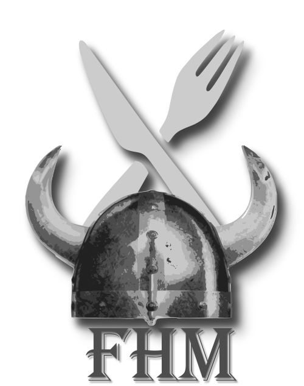

<h1 align="center">Los Asgardianos</h1><h4 align="center">

 

  
##
  
## Juan Manuel Figueiras :
<table>
<thead>
<th>Tarea</th>
<th>Descripción</th>
<th>Prioridad</th>
<th>Horas de trabajo</th>
<th>Fecha de commit</th>
</thead>
<tbody>
<tr>
<td>Alta del producto</td>
<td>Desarrollo de un componente para realizar el registro de productos en la base de datos de la comanda</td>
<td>HIGH</td>
<td>6hs</td>
<td>20 de Mayo</td>
</tr>
<tr>
<td>QR Mesa</td>
<td>Se llevo a cabo el componente para poder leer los códigos QR de la mesa, se realizaron pruebas de testing sobre el mismo. </td>
<td>HIGH</td>
<td>5hs</td>
<td>27 de Mayo</td>
</tr>
<tr>
<td>Encuesta del empleado</td>
<td>Se efectuó el modulo encargado de realizar la encuesta dirigida al empleado luego de sus correspondientes horas de trabajo</td>
<td>MEDIUM</td>
<td>3hs</td>
<td>29 de Mayo</td>
</tr>
<tr>
<td>Tomar pedido</td>
<td>Se realizo el componente responsable de tomar los pedidos de los clientes para comenzar con el recorrido mínimo que debe hacer el mismo</td>
<td>HIGH</td>
<td>7hs</td>
<td>5 de Junio</td>
</tr>
<tr>
<td>Push notificación pedido</td>
<td>Se desarrolló el componente push notificación que indica al usuario información relacionada al pedido</td>
<td>LOW</td>
<td>2hs</td>
<td>11 de Junio</td>
</tr>
<tr>
<td>Configuración Firebase</td>
<td>Configuración completa de Firebase y su vinculación con la aplicación</td>
<td>HIGH</td>
<td>4hs</td>
<td>N/A</td>
</tr>
</tbody>
</table>

## Federico Henseler :
<table>
<thead>
<th>Tarea</th>
<th>Descripción</th>
<th>Prioridad</th>
<th>Horas de trabajo</th>
<th>Fecha de commit</th>
</thead>
<tbody>
<tr>
<td>Alta del empleado</td>
<td>Desarrollo de un componente para realizar el registro de empleados en la base de datos de la comanda</td>
<td>HIGH</td>
<td>5hs</td>
<td>24 de Mayo</td>
</tr>
<tr>
<td>QR Ingreso</td>
<td>Se llevo a cabo el componente para poder leer los códigos QR en el ingreso, se realizaron pruebas de testing sobre el mismo. </td>
<td>HIGH</td>
<td>8hs</td>
<td>29 de Mayo</td>
</tr>
<tr>
<td>Encuesta del cliente</td>
<td>Se efectuó el modulo encargado de realizar la encuesta dirigida al cliente luego de ofrecerle servicios</td>
<td>MEDIUM</td>
<td>1hs</td>
<td>2 de Junio</td>
</tr>
<tr>
<td>Pedir producto</td>
<td>Se realizo el componente encargado de la interacción de pedidos de los clientes</td>
<td>HIGH</td>
<td>4hs</td>
<td>5 de Junio</td>
</tr>
<tr>
<td>Push notificación mesa</td>
<td>Se desarrolló el componente push notificación que indica al usuario información relacionada a la mesa</td>
<td>LOW</td>
<td>2hs</td>
<td>8 de Junio</td>
</tr>
<tr>
<td>Mapas</td>
<td>Configuración completa de mapeo y su vinculación con la aplicación</td>
<td>HIGH</td>
<td>15hs</td>
<td>13 de Junio</td>
</tr>
</tbody>
</table>
